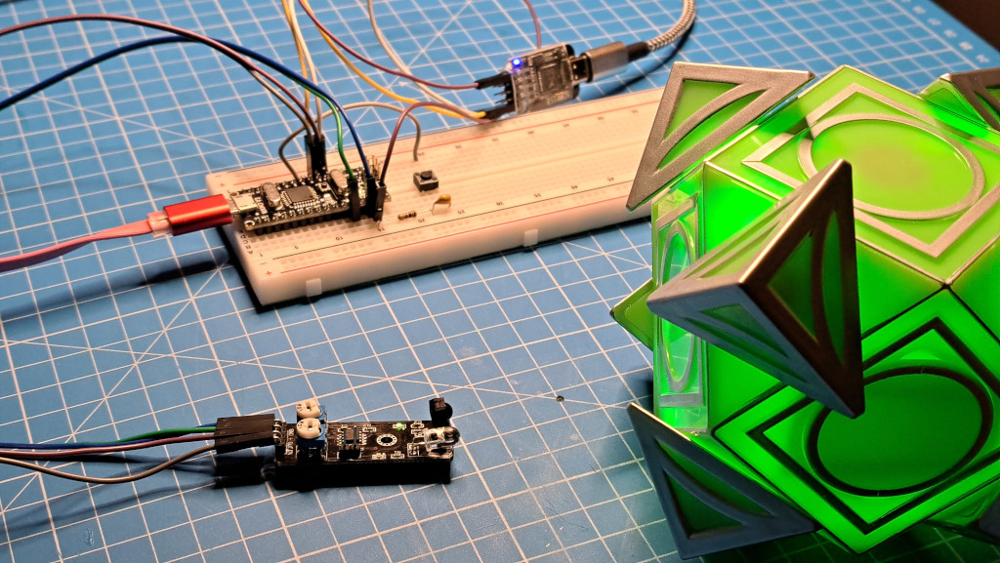

# Holocron Toolbox
This is an [Arduino IDE](https://www.arduino.cc/en/software) sketch for interfacing with Galaxy's Edge Holocrons. 

## A Work In Progress
This code is very much a work in progress. Features may be buggy or missing altogether. Questionable choices in
code functionality may be found throughout the source. I've tried to document my intentions in the hopes you may
find them somewhat understandable. Good luck!

*Thise code is presented AS-IS without warranty. Use at your own risk.*

## Hardware Setup
To interface with the holocron you'll need an IR transmitter and receiver. Something like a 
[KY-032 IR Obstacle Avoidance Sensor](https://www.ebay.com/sch/i.html?_nkw=KY-032&_sacat=0), which has both, would
work. [Discrete IR LED and IR receiver](https://www.amazon.com/dp/B06XYNDRGF/) can also be used. A 
[button of some type](https://www.ebay.com/sch/i.html?_nkw=momentary+push+button&_sacat=0&_sop=15) is also useful 
so that you can trigger button events with the holocron.

### With A KY-032 Module
I have an [Arduino Nano](https://www.ebay.com/sch/i.html?_nkw=Arduino%20Nano) wired up to a 
[KY-032 IR module](https://www.ebay.com/sch/i.html?_nkw=KY-032&_sacat=0).
The GND and + pins of the KY-032 are attached to GND and 5V respectively on the Nano. The OUT pin is attached to 
digital pin 2 (IR_RECV_PIN), and the EN(able) pin is wired to digital pin 3 (IR_SEND_PIN).

The IR module has a jumper on it. When in place, the transmitter is always on. For this project to work, you need to 
remove that jumper. Without the jumper, the transmitter is turned on by seting that pin HIGH.

The IR module uses an on-board 555 timer to generate a high frequency square wave used by the IR transmitter. This
frequency can be tuned using the potentiometer on the module that is closest to the EN(able) pin. Holocrons use a 
38kHz carrier wave, which is achieveable with the potentiometer tuned to its halfway point. If needed you can fine-tune it
by pointing it at a holocron and changing the potentiometer until the Nano reports that it sees the holocron.

### With An IR LED and IR Receiver
The KY-032 module generates its own carrier signal when transmitting data. A standalone IR LED does not do this and
the carrier signal will need to be generated in software. The
[Arduino-IRremote](https://github.com/Arduino-IRremote/Arduino-IRremote/) library is used to do this. If using a
standlone IR LED you will need to install that library and uncomment the line `//#define USE_IRREMOTE_LIB` in the 
source code in order to enable the library.

For my setup, I have an IR LED wired between digital pin 3 (IR_SEND_PIN) and ground with a 1K resistor in series 
with the LED (in other words, the resistor can go on either side of the LED). The resistor value doesn't have to 
be 1K, it could be anything between 100 and 1K, maybe even higher values would work, experiment!

For the IR receiver you'll have three pins: power (VCC), ground (GND), and data (OUT or DAT). Power and ground can 
be connected to the same lines powering your microcontroller. Your microcontroller module probably has a 5V and GND
line, connect to those. For the DAT/OUT pin, I have mine connected to digital pin 2 (IR_RECV_PIN).

If you're unsure about the pinout of your IR module, unsure about the IR LED resistor, and want something the helps
simplify the hookup of these elements, look for Arduino friendly modules [such as these](https://www.amazon.com/dp/B08X2MFS6S/).

If you're trying to use an IR transistor on its own, at the moment, I have nothing here to help you. I am still 
working on figuring that one out. Does it need a capcitor? An op-amp? Hmm..

### The Button
I have a button with one end connected to digital pin 5 and the other connected to ground via a 1k resistor. The resistor
is not necessary as I am using the internal pullup resistor of the ATMega328P, but it may be required for you if you're using 
different hardware. A small (100nF) capacitor is in parallel with the button in a hopeless attempt to prevent debouncing, but I'll
probably fix it with code, later.

## Usage / Features

### Sith Mode
When the program starts up, it acts as a Sith holocron and waits for a Jedi holocron to appear. When it detects a Jedi holocron it 
will alert you via the serial monitor. Press the button once and it will attempt to pair with the Jedi holocron. Once paired, you 
can press the button to simulate pressing the button on a Sith holocron, causing the Jedi holocron to play an audio clip.

To disconnect, remove the holocron or power it off. The code will detect the holocron has been removed and go back to waiting for
a holocron to appear.

### Jedi Mode
While idling in Sith mode you can get the code to change to Jedi mode by pressing the button. Hold the button down for more
than 1 second before releasing it and it'll behave like a series 2 Jedi holocron, otherwise it'll behave as a series 1 Jedi
holocron.

In this mode it will send out a beacon that Sith holocrons will pickup on and respond to. The code will alert via the serial
monitor when a Sith holocron pairs with it. Remove the Sith holocron from view or turn it off and then code reverts to 
searching for another Sith holocron.

While idle in Jedi mode, hold the button down for more than 1 second then release it to place the code back into Sith mode.

## Good Luck!
